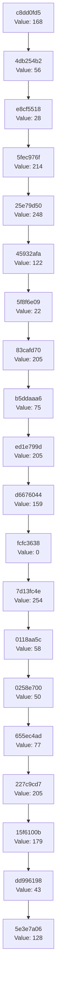

# Hash Chain Visualization

```mermaid
graph TD
    C0["5e3e7a06<br/>Value: 128"]
    C1["dd996198<br/>Value: 43"]
    C1 --> C0
    C2["15f6100b<br/>Value: 179"]
    C2 --> C1
    C3["227c9cd7<br/>Value: 205"]
    C3 --> C2
    C4["655ec4ad<br/>Value: 77"]
    C4 --> C3
    C5["0258e700<br/>Value: 50"]
    C5 --> C4
    C6["0118aa5c<br/>Value: 58"]
    C6 --> C5
    C7["7d13fc4e<br/>Value: 254"]
    C7 --> C6
    C8["fcfc3638<br/>Value: 0"]
    C8 --> C7
    C9["d6676044<br/>Value: 159"]
    C9 --> C8
    C10["ed1e799d<br/>Value: 205"]
    C10 --> C9
    C11["b5ddaaa6<br/>Value: 75"]
    C11 --> C10
    C12["83cafd70<br/>Value: 205"]
    C12 --> C11
    C13["5f8f6e09<br/>Value: 22"]
    C13 --> C12
    C14["45932afa<br/>Value: 122"]
    C14 --> C13
    C15["25e79d50<br/>Value: 248"]
    C15 --> C14
    C16["5fec976f<br/>Value: 214"]
    C16 --> C15
    C17["e8cf5518<br/>Value: 28"]
    C17 --> C16
    C18["4db254b2<br/>Value: 56"]
    C18 --> C17
    C19["c8dd0fd5<br/>Value: 168"]
    C19 --> C18
```