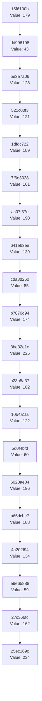

# Hash Chain Visualization

```mermaid
graph TD
    C0["25ec169c<br/>Value: 234"]
    C1["27c366fc<br/>Value: 162"]
    C1 --> C0
    C2["e9e65888<br/>Value: 59"]
    C2 --> C1
    C3["4a202f94<br/>Value: 134"]
    C3 --> C2
    C4["a66dcbe7<br/>Value: 188"]
    C4 --> C3
    C5["6023ae04<br/>Value: 196"]
    C5 --> C4
    C6["5d0f4bfd<br/>Value: 60"]
    C6 --> C5
    C7["10b4a1fa<br/>Value: 122"]
    C7 --> C6
    C8["a23a5a37<br/>Value: 102"]
    C8 --> C7
    C9["3be32e1e<br/>Value: 225"]
    C9 --> C8
    C10["b7870d94<br/>Value: 174"]
    C10 --> C9
    C11["cda8d260<br/>Value: 85"]
    C11 --> C10
    C12["641e63ee<br/>Value: 139"]
    C12 --> C11
    C13["ac07f37e<br/>Value: 190"]
    C13 --> C12
    C14["7f6e3028<br/>Value: 161"]
    C14 --> C13
    C15["1dfdc722<br/>Value: 109"]
    C15 --> C14
    C16["521c00f3<br/>Value: 121"]
    C16 --> C15
    C17["5e3e7a06<br/>Value: 128"]
    C17 --> C16
    C18["dd996198<br/>Value: 43"]
    C18 --> C17
    C19["15f6100b<br/>Value: 179"]
    C19 --> C18
```