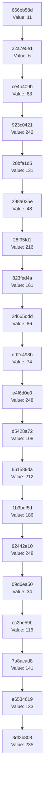

# Hash Chain Visualization

```mermaid
graph TD
    C0["3df3b808<br/>Value: 235"]
    C1["e6534619<br/>Value: 133"]
    C1 --> C0
    C2["7a8acad8<br/>Value: 141"]
    C2 --> C1
    C3["cc2be59b<br/>Value: 116"]
    C3 --> C2
    C4["09d6ea50<br/>Value: 34"]
    C4 --> C3
    C5["92442e10<br/>Value: 248"]
    C5 --> C4
    C6["1b3bdf5d<br/>Value: 186"]
    C6 --> C5
    C7["661589da<br/>Value: 212"]
    C7 --> C6
    C8["d5428a72<br/>Value: 108"]
    C8 --> C7
    C9["e4f6d0e0<br/>Value: 248"]
    C9 --> C8
    C10["dd2c498b<br/>Value: 74"]
    C10 --> C9
    C11["2d665ddd<br/>Value: 86"]
    C11 --> C10
    C12["823fed4a<br/>Value: 161"]
    C12 --> C11
    C13["28f95fd1<br/>Value: 216"]
    C13 --> C12
    C14["298a035e<br/>Value: 48"]
    C14 --> C13
    C15["28bfa1d5<br/>Value: 131"]
    C15 --> C14
    C16["923c0421<br/>Value: 242"]
    C16 --> C15
    C17["ce4b409b<br/>Value: 83"]
    C17 --> C16
    C18["22a7e5e1<br/>Value: 6"]
    C18 --> C17
    C19["666bb58d<br/>Value: 11"]
    C19 --> C18
```