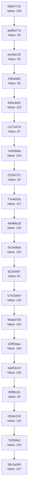

# Hash Chain Visualization

```mermaid
graph TD
    C0["36c2a3d9<br/>Value: 127"]
    C1["73269fe2<br/>Value: 104"]
    C1 --> C0
    C2["c5b4c019<br/>Value: 110"]
    C2 --> C1
    C3["85ffdc2d<br/>Value: 34"]
    C3 --> C2
    C4["2ad53c43<br/>Value: 225"]
    C4 --> C3
    C5["e29f3aaa<br/>Value: 164"]
    C5 --> C4
    C6["99abd708<br/>Value: 162"]
    C6 --> C5
    C7["b7425d04<br/>Value: 142"]
    C7 --> C6
    C8["82245fd7<br/>Value: 61"]
    C8 --> C7
    C9["2e1e08ab<br/>Value: 120"]
    C9 --> C8
    C10["4d488e18<br/>Value: 132"]
    C10 --> C9
    C11["77e465da<br/>Value: 117"]
    C11 --> C10
    C12["22160721<br/>Value: 18"]
    C12 --> C11
    C13["7e058b8e<br/>Value: 216"]
    C13 --> C12
    C14["c127a47d<br/>Value: 97"]
    C14 --> C13
    C15["495e3b62<br/>Value: 119"]
    C15 --> C14
    C16["23bafab5<br/>Value: 35"]
    C16 --> C15
    C17["ee40ec30<br/>Value: 33"]
    C17 --> C16
    C18["aa89a77a<br/>Value: 36"]
    C18 --> C17
    C19["6dd0772b<br/>Value: 228"]
    C19 --> C18
```