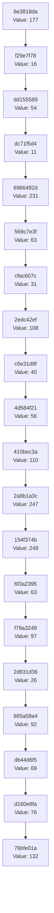

# Hash Chain Visualization

```mermaid
graph TD
    C0["76bfe01a<br/>Value: 132"]
    C1["d160e8fa<br/>Value: 76"]
    C1 --> C0
    C2["db44d6f5<br/>Value: 69"]
    C2 --> C1
    C3["885a58a4<br/>Value: 92"]
    C3 --> C2
    C4["2d831d36<br/>Value: 26"]
    C4 --> C3
    C5["f78a3248<br/>Value: 97"]
    C5 --> C4
    C6["6f3a2395<br/>Value: 63"]
    C6 --> C5
    C7["154f374b<br/>Value: 249"]
    C7 --> C6
    C8["2a8b1a3c<br/>Value: 247"]
    C8 --> C7
    C9["410bec3a<br/>Value: 110"]
    C9 --> C8
    C10["4d584f21<br/>Value: 56"]
    C10 --> C9
    C11["c6e31d8f<br/>Value: 40"]
    C11 --> C10
    C12["2edc42ef<br/>Value: 108"]
    C12 --> C11
    C13["cfac607c<br/>Value: 31"]
    C13 --> C12
    C14["569c7e3f<br/>Value: 63"]
    C14 --> C13
    C15["6966492d<br/>Value: 231"]
    C15 --> C14
    C16["dc71f5d4<br/>Value: 11"]
    C16 --> C15
    C17["dd155589<br/>Value: 54"]
    C17 --> C16
    C18["f29e7f78<br/>Value: 16"]
    C18 --> C17
    C19["8e3818da<br/>Value: 177"]
    C19 --> C18
```