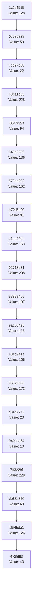

# Hash Chain Visualization

```mermaid
graph TD
    C0["4725fff3<br/>Value: 43"]
    C1["15f4bda1<br/>Value: 126"]
    C1 --> C0
    C2["db88c350<br/>Value: 69"]
    C2 --> C1
    C3["7ff3229f<br/>Value: 228"]
    C3 --> C2
    C4["940cba54<br/>Value: 10"]
    C4 --> C3
    C5["d34a7772<br/>Value: 20"]
    C5 --> C4
    C6["95526028<br/>Value: 172"]
    C6 --> C5
    C7["484d941a<br/>Value: 106"]
    C7 --> C6
    C8["ea1654e5<br/>Value: 116"]
    C8 --> C7
    C9["8393e40d<br/>Value: 197"]
    C9 --> C8
    C10["02713a31<br/>Value: 208"]
    C10 --> C9
    C11["d1aa20db<br/>Value: 153"]
    C11 --> C10
    C12["a70d5c00<br/>Value: 91"]
    C12 --> C11
    C13["873ad083<br/>Value: 162"]
    C13 --> C12
    C14["549e3309<br/>Value: 136"]
    C14 --> C13
    C15["68d7c27f<br/>Value: 94"]
    C15 --> C14
    C16["43ba1d63<br/>Value: 228"]
    C16 --> C15
    C17["7cd27b68<br/>Value: 22"]
    C17 --> C16
    C18["0c230328<br/>Value: 59"]
    C18 --> C17
    C19["1c1c4955<br/>Value: 128"]
    C19 --> C18
```