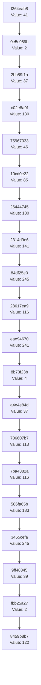

# Hash Chain Visualization

```mermaid
graph TD
    C0["8459b8b7<br/>Value: 122"]
    C1["fbb25a27<br/>Value: 2"]
    C1 --> C0
    C2["9ff48345<br/>Value: 39"]
    C2 --> C1
    C3["3455cefa<br/>Value: 245"]
    C3 --> C2
    C4["586fa65b<br/>Value: 183"]
    C4 --> C3
    C5["7ba4382a<br/>Value: 116"]
    C5 --> C4
    C6["706607b7<br/>Value: 113"]
    C6 --> C5
    C7["a4e4e84d<br/>Value: 37"]
    C7 --> C6
    C8["8b73f23b<br/>Value: 4"]
    C8 --> C7
    C9["eae94670<br/>Value: 241"]
    C9 --> C8
    C10["28617ea9<br/>Value: 116"]
    C10 --> C9
    C11["84df25e0<br/>Value: 245"]
    C11 --> C10
    C12["2314d9e6<br/>Value: 141"]
    C12 --> C11
    C13["26444745<br/>Value: 180"]
    C13 --> C12
    C14["10cd0e22<br/>Value: 85"]
    C14 --> C13
    C15["75967033<br/>Value: 46"]
    C15 --> C14
    C16["c02e8a9f<br/>Value: 130"]
    C16 --> C15
    C17["2bb89f1a<br/>Value: 37"]
    C17 --> C16
    C18["0e5c959b<br/>Value: 2"]
    C18 --> C17
    C19["f364eab8<br/>Value: 41"]
    C19 --> C18
```