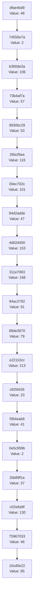

# Hash Chain Visualization

```mermaid
graph TD
    C0["10cd0e22<br/>Value: 85"]
    C1["75967033<br/>Value: 46"]
    C1 --> C0
    C2["c02e8a9f<br/>Value: 130"]
    C2 --> C1
    C3["2bb89f1a<br/>Value: 37"]
    C3 --> C2
    C4["0e5c959b<br/>Value: 2"]
    C4 --> C3
    C5["f364eab8<br/>Value: 41"]
    C5 --> C4
    C6["c82fd426<br/>Value: 23"]
    C6 --> C5
    C7["e22110cc<br/>Value: 213"]
    C7 --> C6
    C8["89de3670<br/>Value: 79"]
    C8 --> C7
    C9["94ac2792<br/>Value: 91"]
    C9 --> C8
    C10["311e7083<br/>Value: 168"]
    C10 --> C9
    C11["4d02d400<br/>Value: 153"]
    C11 --> C10
    C12["84d2adde<br/>Value: 47"]
    C12 --> C11
    C13["00ec702c<br/>Value: 101"]
    C13 --> C12
    C14["26bcf5ea<br/>Value: 116"]
    C14 --> C13
    C15["9930bc29<br/>Value: 53"]
    C15 --> C14
    C16["73b4af7a<br/>Value: 57"]
    C16 --> C15
    C17["b390de3a<br/>Value: 106"]
    C17 --> C16
    C18["74556e7a<br/>Value: 2"]
    C18 --> C17
    C19["dfae4bd9<br/>Value: 48"]
    C19 --> C18
```