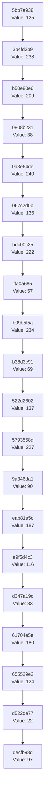

# Hash Chain Visualization

```mermaid
graph TD
    C0["decfb98d<br/>Value: 97"]
    C1["d522de77<br/>Value: 22"]
    C1 --> C0
    C2["655529e2<br/>Value: 124"]
    C2 --> C1
    C3["61704e5e<br/>Value: 180"]
    C3 --> C2
    C4["d347a19c<br/>Value: 83"]
    C4 --> C3
    C5["e9f5d4c3<br/>Value: 116"]
    C5 --> C4
    C6["eab81a5c<br/>Value: 187"]
    C6 --> C5
    C7["9a346da1<br/>Value: 90"]
    C7 --> C6
    C8["5793558d<br/>Value: 227"]
    C8 --> C7
    C9["522d2602<br/>Value: 137"]
    C9 --> C8
    C10["b38d3c91<br/>Value: 69"]
    C10 --> C9
    C11["b09b5f5a<br/>Value: 234"]
    C11 --> C10
    C12["ffa0a685<br/>Value: 57"]
    C12 --> C11
    C13["bdc00c25<br/>Value: 222"]
    C13 --> C12
    C14["067c2d0b<br/>Value: 136"]
    C14 --> C13
    C15["0a3e64de<br/>Value: 240"]
    C15 --> C14
    C16["0808b231<br/>Value: 38"]
    C16 --> C15
    C17["b50e80e6<br/>Value: 209"]
    C17 --> C16
    C18["3b4fd2b9<br/>Value: 238"]
    C18 --> C17
    C19["5bb7a938<br/>Value: 125"]
    C19 --> C18
```