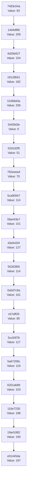

# Hash Chain Visualization

```mermaid
graph TD
    C0["e01445da<br/>Value: 197"]
    C1["19a41882<br/>Value: 190"]
    C1 --> C0
    C2["116e7230<br/>Value: 188"]
    C2 --> C1
    C3["6201ab89<br/>Value: 103"]
    C3 --> C2
    C4["5a67208c<br/>Value: 119"]
    C4 --> C3
    C5["5cc50f78<br/>Value: 117"]
    C5 --> C4
    C6["cb7aff29<br/>Value: 85"]
    C6 --> C5
    C7["0a5d7c9a<br/>Value: 161"]
    C7 --> C6
    C8["55263f65<br/>Value: 114"]
    C8 --> C7
    C9["d3d442f4<br/>Value: 127"]
    C9 --> C8
    C10["59a443e7<br/>Value: 151"]
    C10 --> C9
    C11["5ca90947<br/>Value: 114"]
    C11 --> C10
    C12["782eeea4<br/>Value: 70"]
    C12 --> C11
    C13["52d1d2f6<br/>Value: 51"]
    C13 --> C12
    C14["3445fd3e<br/>Value: 0"]
    C14 --> C13
    C15["51968d3a<br/>Value: 206"]
    C15 --> C14
    C16["18128b51<br/>Value: 182"]
    C16 --> C15
    C17["4d29d427<br/>Value: 154"]
    C17 --> C16
    C18["14d4df86<br/>Value: 209"]
    C18 --> C17
    C19["7483c04a<br/>Value: 93"]
    C19 --> C18
```