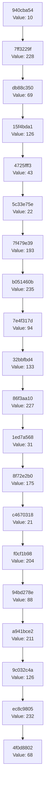

# Hash Chain Visualization

```mermaid
graph TD
    C0["4f0d8802<br/>Value: 68"]
    C1["ec8c9805<br/>Value: 232"]
    C1 --> C0
    C2["9c032c4a<br/>Value: 126"]
    C2 --> C1
    C3["a941bce2<br/>Value: 211"]
    C3 --> C2
    C4["94bd278e<br/>Value: 88"]
    C4 --> C3
    C5["f0cf1b98<br/>Value: 204"]
    C5 --> C4
    C6["c4670318<br/>Value: 21"]
    C6 --> C5
    C7["8f72e2b0<br/>Value: 175"]
    C7 --> C6
    C8["1ed7a568<br/>Value: 31"]
    C8 --> C7
    C9["86f3aa10<br/>Value: 227"]
    C9 --> C8
    C10["32bbfbd4<br/>Value: 133"]
    C10 --> C9
    C11["7e4f317d<br/>Value: 94"]
    C11 --> C10
    C12["b051460b<br/>Value: 235"]
    C12 --> C11
    C13["7f479e39<br/>Value: 193"]
    C13 --> C12
    C14["5c33e75e<br/>Value: 22"]
    C14 --> C13
    C15["4725fff3<br/>Value: 43"]
    C15 --> C14
    C16["15f4bda1<br/>Value: 126"]
    C16 --> C15
    C17["db88c350<br/>Value: 69"]
    C17 --> C16
    C18["7ff3229f<br/>Value: 228"]
    C18 --> C17
    C19["940cba54<br/>Value: 10"]
    C19 --> C18
```