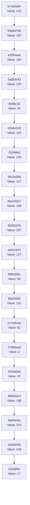

# Hash Chain Visualization

```mermaid
graph TD
    C0["1d338f5c<br/>Value: 17"]
    C1["1b6d635b<br/>Value: 109"]
    C1 --> C0
    C2["9af46e0a<br/>Value: 224"]
    C2 --> C1
    C3["396b5dc4<br/>Value: 198"]
    C3 --> C2
    C4["2f10dd4d<br/>Value: 42"]
    C4 --> C3
    C5["77068ea0<br/>Value: 2"]
    C5 --> C4
    C6["e17e8cae<br/>Value: 51"]
    C6 --> C5
    C7["f0d2566b<br/>Value: 151"]
    C7 --> C6
    C8["f9903d9c<br/>Value: 69"]
    C8 --> C7
    C9["ae81cb41<br/>Value: 127"]
    C9 --> C8
    C10["30282076<br/>Value: 237"]
    C10 --> C9
    C11["8a1d3d17<br/>Value: 148"]
    C11 --> C10
    C12["36c2a3d9<br/>Value: 127"]
    C12 --> C11
    C13["73269fe2<br/>Value: 104"]
    C13 --> C12
    C14["c5b4c019<br/>Value: 110"]
    C14 --> C13
    C15["85ffdc2d<br/>Value: 34"]
    C15 --> C14
    C16["2ad53c43<br/>Value: 225"]
    C16 --> C15
    C17["e29f3aaa<br/>Value: 164"]
    C17 --> C16
    C18["99abd708<br/>Value: 162"]
    C18 --> C17
    C19["b7425d04<br/>Value: 142"]
    C19 --> C18
```