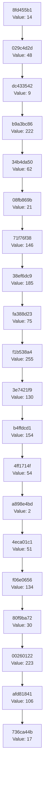

# Hash Chain Visualization

```mermaid
graph TD
    C0["736ca44b<br/>Value: 17"]
    C1["afd81841<br/>Value: 106"]
    C1 --> C0
    C2["00260122<br/>Value: 223"]
    C2 --> C1
    C3["80f9ba72<br/>Value: 30"]
    C3 --> C2
    C4["f06e0656<br/>Value: 134"]
    C4 --> C3
    C5["4eca01c1<br/>Value: 51"]
    C5 --> C4
    C6["a898e4bd<br/>Value: 2"]
    C6 --> C5
    C7["4ff1714f<br/>Value: 54"]
    C7 --> C6
    C8["b4ffdcd1<br/>Value: 154"]
    C8 --> C7
    C9["3e7421f9<br/>Value: 130"]
    C9 --> C8
    C10["f1b538a4<br/>Value: 255"]
    C10 --> C9
    C11["fa388d23<br/>Value: 75"]
    C11 --> C10
    C12["38ef6dc9<br/>Value: 185"]
    C12 --> C11
    C13["71f76f38<br/>Value: 146"]
    C13 --> C12
    C14["08fb869b<br/>Value: 21"]
    C14 --> C13
    C15["34b4da50<br/>Value: 62"]
    C15 --> C14
    C16["b9a3bc86<br/>Value: 222"]
    C16 --> C15
    C17["dc433542<br/>Value: 9"]
    C17 --> C16
    C18["029c4d2d<br/>Value: 48"]
    C18 --> C17
    C19["8fd455b1<br/>Value: 14"]
    C19 --> C18
```