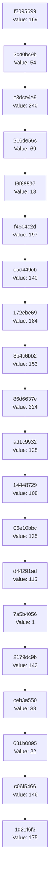

# Hash Chain Visualization

```mermaid
graph TD
    C0["1d21f6f3<br/>Value: 175"]
    C1["c06f5466<br/>Value: 146"]
    C1 --> C0
    C2["681b0895<br/>Value: 22"]
    C2 --> C1
    C3["ceb3a550<br/>Value: 38"]
    C3 --> C2
    C4["2179dc9b<br/>Value: 142"]
    C4 --> C3
    C5["7a5b4056<br/>Value: 1"]
    C5 --> C4
    C6["d44291ad<br/>Value: 115"]
    C6 --> C5
    C7["06e10bbc<br/>Value: 135"]
    C7 --> C6
    C8["14448729<br/>Value: 108"]
    C8 --> C7
    C9["ad1c9932<br/>Value: 128"]
    C9 --> C8
    C10["86d6637e<br/>Value: 224"]
    C10 --> C9
    C11["3b4c6bb2<br/>Value: 153"]
    C11 --> C10
    C12["172ebe69<br/>Value: 184"]
    C12 --> C11
    C13["ead449cb<br/>Value: 140"]
    C13 --> C12
    C14["f4604c2d<br/>Value: 197"]
    C14 --> C13
    C15["f6f66597<br/>Value: 18"]
    C15 --> C14
    C16["216de56c<br/>Value: 69"]
    C16 --> C15
    C17["c3dce4a9<br/>Value: 240"]
    C17 --> C16
    C18["2c40bc9b<br/>Value: 54"]
    C18 --> C17
    C19["f3095699<br/>Value: 169"]
    C19 --> C18
```