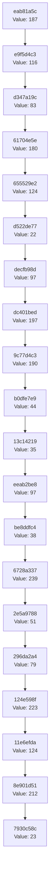

# Hash Chain Visualization

```mermaid
graph TD
    C0["7930c58c<br/>Value: 23"]
    C1["8e901d51<br/>Value: 212"]
    C1 --> C0
    C2["11e6efda<br/>Value: 124"]
    C2 --> C1
    C3["124e598f<br/>Value: 223"]
    C3 --> C2
    C4["296da2a4<br/>Value: 79"]
    C4 --> C3
    C5["2e5a9788<br/>Value: 51"]
    C5 --> C4
    C6["6728a337<br/>Value: 239"]
    C6 --> C5
    C7["be8ddfc4<br/>Value: 38"]
    C7 --> C6
    C8["eeab2be8<br/>Value: 97"]
    C8 --> C7
    C9["13c14219<br/>Value: 35"]
    C9 --> C8
    C10["b0dfe7e9<br/>Value: 44"]
    C10 --> C9
    C11["9c77d4c3<br/>Value: 190"]
    C11 --> C10
    C12["dc401bed<br/>Value: 197"]
    C12 --> C11
    C13["decfb98d<br/>Value: 97"]
    C13 --> C12
    C14["d522de77<br/>Value: 22"]
    C14 --> C13
    C15["655529e2<br/>Value: 124"]
    C15 --> C14
    C16["61704e5e<br/>Value: 180"]
    C16 --> C15
    C17["d347a19c<br/>Value: 83"]
    C17 --> C16
    C18["e9f5d4c3<br/>Value: 116"]
    C18 --> C17
    C19["eab81a5c<br/>Value: 187"]
    C19 --> C18
```