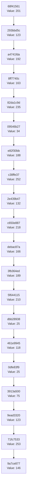

# Hash Chain Visualization

```mermaid
graph TD
    C0["9a7ce877<br/>Value: 146"]
    C1["71fc7533<br/>Value: 253"]
    C1 --> C0
    C2["9ead3320<br/>Value: 123"]
    C2 --> C1
    C3["3913a500<br/>Value: 75"]
    C3 --> C2
    C4["0dfe83f9<br/>Value: 25"]
    C4 --> C3
    C5["461e9945<br/>Value: 118"]
    C5 --> C4
    C6["dbb28938<br/>Value: 25"]
    C6 --> C5
    C7["5f644115<br/>Value: 210"]
    C7 --> C6
    C8["3fb364ed<br/>Value: 189"]
    C8 --> C7
    C9["debac87a<br/>Value: 166"]
    C9 --> C8
    C10["c650e887<br/>Value: 218"]
    C10 --> C9
    C11["2e439b47<br/>Value: 132"]
    C11 --> C10
    C12["c38ffe37<br/>Value: 252"]
    C12 --> C11
    C13["e82f30bb<br/>Value: 188"]
    C13 --> C12
    C14["09546b27<br/>Value: 34"]
    C14 --> C13
    C15["82da1c9d<br/>Value: 235"]
    C15 --> C14
    C16["8ff7740c<br/>Value: 163"]
    C16 --> C15
    C17["a4741fda<br/>Value: 192"]
    C17 --> C16
    C18["293bbd5c<br/>Value: 123"]
    C18 --> C17
    C19["68f41561<br/>Value: 201"]
    C19 --> C18
```