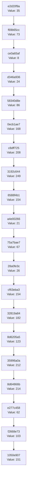

# Hash Chain Visualization

```mermaid
graph TD
    C0["1050e907<br/>Value: 151"]
    C1["f2668e73<br/>Value: 103"]
    C1 --> C0
    C2["e277c458<br/>Value: 62"]
    C2 --> C1
    C3["8d64866b<br/>Value: 214"]
    C3 --> C2
    C4["35996a0a<br/>Value: 212"]
    C4 --> C3
    C5["8d6205a5<br/>Value: 123"]
    C5 --> C4
    C6["32819a84<br/>Value: 182"]
    C6 --> C5
    C7["cf63eba3<br/>Value: 154"]
    C7 --> C6
    C8["28a0fe3c<br/>Value: 26"]
    C8 --> C7
    C9["75a7bae7<br/>Value: 67"]
    C9 --> C8
    C10["a4e00266<br/>Value: 21"]
    C10 --> C9
    C11["8588f4b1<br/>Value: 154"]
    C11 --> C10
    C12["3192c644<br/>Value: 249"]
    C12 --> C11
    C13["c8dff725<br/>Value: 208"]
    C13 --> C12
    C14["0ecb1ae7<br/>Value: 168"]
    C14 --> C13
    C15["58340d8e<br/>Value: 86"]
    C15 --> C14
    C16["d346a936<br/>Value: 24"]
    C16 --> C15
    C17["ce0a65af<br/>Value: 8"]
    C17 --> C16
    C18["f69b65cc<br/>Value: 73"]
    C18 --> C17
    C19["e2d20f9a<br/>Value: 35"]
    C19 --> C18
```