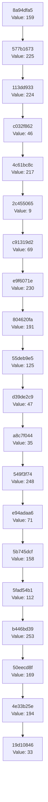

# Hash Chain Visualization

```mermaid
graph TD
    C0["19d10846<br/>Value: 33"]
    C1["4e33b25e<br/>Value: 194"]
    C1 --> C0
    C2["50eecd8f<br/>Value: 169"]
    C2 --> C1
    C3["b446bd39<br/>Value: 253"]
    C3 --> C2
    C4["5fad54b1<br/>Value: 112"]
    C4 --> C3
    C5["5b745dcf<br/>Value: 158"]
    C5 --> C4
    C6["e94adaa6<br/>Value: 71"]
    C6 --> C5
    C7["549f3f74<br/>Value: 248"]
    C7 --> C6
    C8["a8c7f044<br/>Value: 35"]
    C8 --> C7
    C9["d39de2c9<br/>Value: 47"]
    C9 --> C8
    C10["55deb9e5<br/>Value: 125"]
    C10 --> C9
    C11["804620fa<br/>Value: 191"]
    C11 --> C10
    C12["e9f6071e<br/>Value: 230"]
    C12 --> C11
    C13["c91319d2<br/>Value: 69"]
    C13 --> C12
    C14["2c455065<br/>Value: 9"]
    C14 --> C13
    C15["4c61bc8c<br/>Value: 217"]
    C15 --> C14
    C16["c032f862<br/>Value: 46"]
    C16 --> C15
    C17["113dd933<br/>Value: 224"]
    C17 --> C16
    C18["577b1673<br/>Value: 225"]
    C18 --> C17
    C19["8a94dfa5<br/>Value: 159"]
    C19 --> C18
```