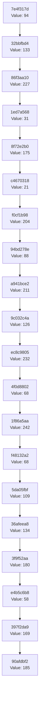

# Hash Chain Visualization

```mermaid
graph TD
    C0["90afdbf2<br/>Value: 185"]
    C1["397f2da9<br/>Value: 169"]
    C1 --> C0
    C2["e4b5c6b8<br/>Value: 58"]
    C2 --> C1
    C3["3f9f52aa<br/>Value: 180"]
    C3 --> C2
    C4["36afeea8<br/>Value: 134"]
    C4 --> C3
    C5["5da05fbf<br/>Value: 109"]
    C5 --> C4
    C6["f48132a2<br/>Value: 68"]
    C6 --> C5
    C7["1f86a5aa<br/>Value: 242"]
    C7 --> C6
    C8["4f0d8802<br/>Value: 68"]
    C8 --> C7
    C9["ec8c9805<br/>Value: 232"]
    C9 --> C8
    C10["9c032c4a<br/>Value: 126"]
    C10 --> C9
    C11["a941bce2<br/>Value: 211"]
    C11 --> C10
    C12["94bd278e<br/>Value: 88"]
    C12 --> C11
    C13["f0cf1b98<br/>Value: 204"]
    C13 --> C12
    C14["c4670318<br/>Value: 21"]
    C14 --> C13
    C15["8f72e2b0<br/>Value: 175"]
    C15 --> C14
    C16["1ed7a568<br/>Value: 31"]
    C16 --> C15
    C17["86f3aa10<br/>Value: 227"]
    C17 --> C16
    C18["32bbfbd4<br/>Value: 133"]
    C18 --> C17
    C19["7e4f317d<br/>Value: 94"]
    C19 --> C18
```