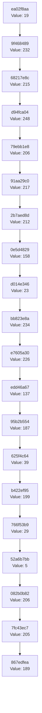

# Hash Chain Visualization

```mermaid
graph TD
    C0["867edfea<br/>Value: 189"]
    C1["7fc43ec7<br/>Value: 205"]
    C1 --> C0
    C2["082b0b82<br/>Value: 206"]
    C2 --> C1
    C3["52a6b7bb<br/>Value: 5"]
    C3 --> C2
    C4["766f53b9<br/>Value: 29"]
    C4 --> C3
    C5["b422ef95<br/>Value: 199"]
    C5 --> C4
    C6["625f4c64<br/>Value: 39"]
    C6 --> C5
    C7["95b2b554<br/>Value: 187"]
    C7 --> C6
    C8["edd46a67<br/>Value: 137"]
    C8 --> C7
    C9["e7605a30<br/>Value: 226"]
    C9 --> C8
    C10["bb823e8a<br/>Value: 234"]
    C10 --> C9
    C11["d014e346<br/>Value: 23"]
    C11 --> C10
    C12["0e5d4829<br/>Value: 158"]
    C12 --> C11
    C13["2b7aed8d<br/>Value: 212"]
    C13 --> C12
    C14["91aa29c0<br/>Value: 217"]
    C14 --> C13
    C15["79ebb1e8<br/>Value: 206"]
    C15 --> C14
    C16["d94fca04<br/>Value: 248"]
    C16 --> C15
    C17["68217e8c<br/>Value: 215"]
    C17 --> C16
    C18["9f468489<br/>Value: 232"]
    C18 --> C17
    C19["ea02f8aa<br/>Value: 19"]
    C19 --> C18
```