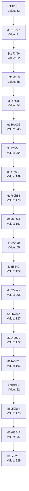

# Hash Chain Visualization

```mermaid
graph TD
    C0["ba6c22b2<br/>Value: 229"]
    C1["d6e835c7<br/>Value: 237"]
    C1 --> C0
    C2["88b50bb4<br/>Value: 175"]
    C2 --> C1
    C3["ed0f193f<br/>Value: 82"]
    C3 --> C2
    C4["881e0d7c<br/>Value: 163"]
    C4 --> C3
    C5["21c4d92b<br/>Value: 172"]
    C5 --> C4
    C6["5b2b734b<br/>Value: 127"]
    C6 --> C5
    C7["db67eaae<br/>Value: 208"]
    C7 --> C6
    C8["fe8f8342<br/>Value: 122"]
    C8 --> C7
    C9["410c26df<br/>Value: 65"]
    C9 --> C8
    C10["02a9b9e9<br/>Value: 157"]
    C10 --> C9
    C11["6c760b85<br/>Value: 170"]
    C11 --> C10
    C12["88a1b033<br/>Value: 189"]
    C12 --> C11
    C13["9d2760ad<br/>Value: 254"]
    C13 --> C12
    C14["e186a006<br/>Value: 245"]
    C14 --> C13
    C15["33c0ff31<br/>Value: 34"]
    C15 --> C14
    C16["c96f68c8<br/>Value: 65"]
    C16 --> C15
    C17["3ce73f96<br/>Value: 32"]
    C17 --> C16
    C18["3551222e<br/>Value: 71"]
    C18 --> C17
    C19["8ff1f101<br/>Value: 53"]
    C19 --> C18
```