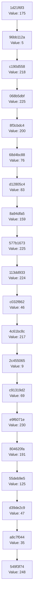

# Hash Chain Visualization

```mermaid
graph TD
    C0["549f3f74<br/>Value: 248"]
    C1["a8c7f044<br/>Value: 35"]
    C1 --> C0
    C2["d39de2c9<br/>Value: 47"]
    C2 --> C1
    C3["55deb9e5<br/>Value: 125"]
    C3 --> C2
    C4["804620fa<br/>Value: 191"]
    C4 --> C3
    C5["e9f6071e<br/>Value: 230"]
    C5 --> C4
    C6["c91319d2<br/>Value: 69"]
    C6 --> C5
    C7["2c455065<br/>Value: 9"]
    C7 --> C6
    C8["4c61bc8c<br/>Value: 217"]
    C8 --> C7
    C9["c032f862<br/>Value: 46"]
    C9 --> C8
    C10["113dd933<br/>Value: 224"]
    C10 --> C9
    C11["577b1673<br/>Value: 225"]
    C11 --> C10
    C12["8a94dfa5<br/>Value: 159"]
    C12 --> C11
    C13["d12805c4<br/>Value: 83"]
    C13 --> C12
    C14["68d4bc88<br/>Value: 76"]
    C14 --> C13
    C15["8f3cbdc4<br/>Value: 200"]
    C15 --> C14
    C16["068b5dbf<br/>Value: 225"]
    C16 --> C15
    C17["c190d558<br/>Value: 218"]
    C17 --> C16
    C18["96bb112a<br/>Value: 5"]
    C18 --> C17
    C19["1d21f6f3<br/>Value: 175"]
    C19 --> C18
```