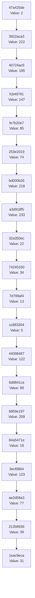

# Hash Chain Visualization

```mermaid
graph TD
    C0["1eac9eca<br/>Value: 31"]
    C1["212b8936<br/>Value: 39"]
    C1 --> C0
    C2["ae2d58a3<br/>Value: 77"]
    C2 --> C1
    C3["3ecf0864<br/>Value: 123"]
    C3 --> C2
    C4["84a5471e<br/>Value: 18"]
    C4 --> C3
    C5["6859e197<br/>Value: 209"]
    C5 --> C4
    C6["6d8841ca<br/>Value: 88"]
    C6 --> C5
    C7["44098487<br/>Value: 122"]
    C7 --> C6
    C8["cc883304<br/>Value: 5"]
    C8 --> C7
    C9["7d799af4<br/>Value: 13"]
    C9 --> C8
    C10["74245330<br/>Value: 34"]
    C10 --> C9
    C11["32a350ec<br/>Value: 22"]
    C11 --> C10
    C12["a3d918f5<br/>Value: 233"]
    C12 --> C11
    C13["bd000b26<br/>Value: 218"]
    C13 --> C12
    C14["253e2019<br/>Value: 74"]
    C14 --> C13
    C15["fe7b20e7<br/>Value: 85"]
    C15 --> C14
    C16["fcb49791<br/>Value: 147"]
    C16 --> C15
    C17["40724ac9<br/>Value: 185"]
    C17 --> C16
    C18["3922aca3<br/>Value: 222"]
    C18 --> C17
    C19["47a425de<br/>Value: 2"]
    C19 --> C18
```