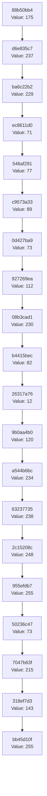

# Hash Chain Visualization

```mermaid
graph TD
    C0["bb45d10f<br/>Value: 255"]
    C1["318ef7d3<br/>Value: 143"]
    C1 --> C0
    C2["7047b63f<br/>Value: 215"]
    C2 --> C1
    C3["50236c47<br/>Value: 73"]
    C3 --> C2
    C4["955efdb7<br/>Value: 255"]
    C4 --> C3
    C5["2c15208c<br/>Value: 248"]
    C5 --> C4
    C6["63237735<br/>Value: 238"]
    C6 --> C5
    C7["a544b6bc<br/>Value: 234"]
    C7 --> C6
    C8["9b0aa4b0<br/>Value: 120"]
    C8 --> C7
    C9["26317a76<br/>Value: 12"]
    C9 --> C8
    C10["b4415bec<br/>Value: 82"]
    C10 --> C9
    C11["08b3cad1<br/>Value: 230"]
    C11 --> C10
    C12["927269ea<br/>Value: 112"]
    C12 --> C11
    C13["0d427ba9<br/>Value: 73"]
    C13 --> C12
    C14["c9573a33<br/>Value: 89"]
    C14 --> C13
    C15["546af291<br/>Value: 77"]
    C15 --> C14
    C16["ec8611d0<br/>Value: 71"]
    C16 --> C15
    C17["ba6c22b2<br/>Value: 229"]
    C17 --> C16
    C18["d6e835c7<br/>Value: 237"]
    C18 --> C17
    C19["88b50bb4<br/>Value: 175"]
    C19 --> C18
```