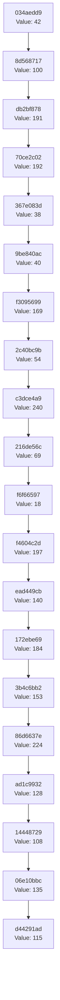

# Hash Chain Visualization

```mermaid
graph TD
    C0["d44291ad<br/>Value: 115"]
    C1["06e10bbc<br/>Value: 135"]
    C1 --> C0
    C2["14448729<br/>Value: 108"]
    C2 --> C1
    C3["ad1c9932<br/>Value: 128"]
    C3 --> C2
    C4["86d6637e<br/>Value: 224"]
    C4 --> C3
    C5["3b4c6bb2<br/>Value: 153"]
    C5 --> C4
    C6["172ebe69<br/>Value: 184"]
    C6 --> C5
    C7["ead449cb<br/>Value: 140"]
    C7 --> C6
    C8["f4604c2d<br/>Value: 197"]
    C8 --> C7
    C9["f6f66597<br/>Value: 18"]
    C9 --> C8
    C10["216de56c<br/>Value: 69"]
    C10 --> C9
    C11["c3dce4a9<br/>Value: 240"]
    C11 --> C10
    C12["2c40bc9b<br/>Value: 54"]
    C12 --> C11
    C13["f3095699<br/>Value: 169"]
    C13 --> C12
    C14["9be840ac<br/>Value: 40"]
    C14 --> C13
    C15["367e083d<br/>Value: 38"]
    C15 --> C14
    C16["70ce2c02<br/>Value: 192"]
    C16 --> C15
    C17["db2bf878<br/>Value: 191"]
    C17 --> C16
    C18["8d568717<br/>Value: 100"]
    C18 --> C17
    C19["034aedd9<br/>Value: 42"]
    C19 --> C18
```