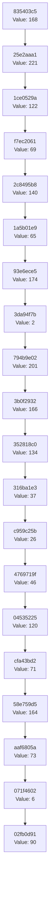

# Hash Chain Visualization

```mermaid
graph TD
    C0["02fb0d91<br/>Value: 90"]
    C1["071f4602<br/>Value: 6"]
    C1 --> C0
    C2["aaf6805a<br/>Value: 73"]
    C2 --> C1
    C3["58e759d5<br/>Value: 164"]
    C3 --> C2
    C4["cfa43bd2<br/>Value: 71"]
    C4 --> C3
    C5["04535225<br/>Value: 120"]
    C5 --> C4
    C6["4769719f<br/>Value: 46"]
    C6 --> C5
    C7["c959c25b<br/>Value: 26"]
    C7 --> C6
    C8["316ba1e3<br/>Value: 37"]
    C8 --> C7
    C9["352818c0<br/>Value: 134"]
    C9 --> C8
    C10["3b0f2932<br/>Value: 166"]
    C10 --> C9
    C11["794b9e02<br/>Value: 201"]
    C11 --> C10
    C12["3da94f7b<br/>Value: 2"]
    C12 --> C11
    C13["93e6ece5<br/>Value: 174"]
    C13 --> C12
    C14["1a5b01e9<br/>Value: 65"]
    C14 --> C13
    C15["2c8495b8<br/>Value: 140"]
    C15 --> C14
    C16["f7ec2061<br/>Value: 69"]
    C16 --> C15
    C17["1ce0529a<br/>Value: 122"]
    C17 --> C16
    C18["25e2aaa1<br/>Value: 221"]
    C18 --> C17
    C19["835403c5<br/>Value: 168"]
    C19 --> C18
```