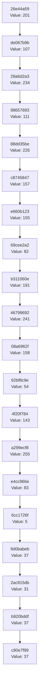

# Hash Chain Visualization

```mermaid
graph TD
    C0["c90e7f99<br/>Value: 37"]
    C1["b920bddf<br/>Value: 37"]
    C1 --> C0
    C2["2ac915db<br/>Value: 31"]
    C2 --> C1
    C3["9d0babeb<br/>Value: 37"]
    C3 --> C2
    C4["6cc1726f<br/>Value: 5"]
    C4 --> C3
    C5["e4cc966e<br/>Value: 83"]
    C5 --> C4
    C6["a299ecf8<br/>Value: 255"]
    C6 --> C5
    C7["4f20f784<br/>Value: 143"]
    C7 --> C6
    C8["62bf8c9e<br/>Value: 54"]
    C8 --> C7
    C9["08a6962f<br/>Value: 158"]
    C9 --> C8
    C10["46799692<br/>Value: 241"]
    C10 --> C9
    C11["b311060e<br/>Value: 191"]
    C11 --> C10
    C12["69cee2a2<br/>Value: 82"]
    C12 --> C11
    C13["e660b123<br/>Value: 155"]
    C13 --> C12
    C14["c8745847<br/>Value: 157"]
    C14 --> C13
    C15["88dd35be<br/>Value: 226"]
    C15 --> C14
    C16["98657693<br/>Value: 111"]
    C16 --> C15
    C17["28a6d2a3<br/>Value: 234"]
    C17 --> C16
    C18["de067b9b<br/>Value: 107"]
    C18 --> C17
    C19["26e44a59<br/>Value: 201"]
    C19 --> C18
```