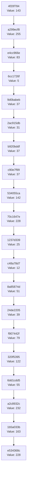

# Hash Chain Visualization

```mermaid
graph TD
    C0["e534368c<br/>Value: 228"]
    C1["1b5a033b<br/>Value: 163"]
    C1 --> C0
    C2["a2c8932c<br/>Value: 232"]
    C2 --> C1
    C3["6dd1cdd5<br/>Value: 55"]
    C3 --> C2
    C4["320f5395<br/>Value: 122"]
    C4 --> C3
    C5["f907442f<br/>Value: 79"]
    C5 --> C4
    C6["24de2205<br/>Value: 39"]
    C6 --> C5
    C7["8a85874d<br/>Value: 51"]
    C7 --> C6
    C8["c48a78d7<br/>Value: 12"]
    C8 --> C7
    C9["1237d339<br/>Value: 25"]
    C9 --> C8
    C10["70c1647e<br/>Value: 228"]
    C10 --> C9
    C11["534055ca<br/>Value: 142"]
    C11 --> C10
    C12["c90e7f99<br/>Value: 37"]
    C12 --> C11
    C13["b920bddf<br/>Value: 37"]
    C13 --> C12
    C14["2ac915db<br/>Value: 31"]
    C14 --> C13
    C15["9d0babeb<br/>Value: 37"]
    C15 --> C14
    C16["6cc1726f<br/>Value: 5"]
    C16 --> C15
    C17["e4cc966e<br/>Value: 83"]
    C17 --> C16
    C18["a299ecf8<br/>Value: 255"]
    C18 --> C17
    C19["4f20f784<br/>Value: 143"]
    C19 --> C18
```