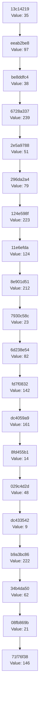

# Hash Chain Visualization

```mermaid
graph TD
    C0["71f76f38<br/>Value: 146"]
    C1["08fb869b<br/>Value: 21"]
    C1 --> C0
    C2["34b4da50<br/>Value: 62"]
    C2 --> C1
    C3["b9a3bc86<br/>Value: 222"]
    C3 --> C2
    C4["dc433542<br/>Value: 9"]
    C4 --> C3
    C5["029c4d2d<br/>Value: 48"]
    C5 --> C4
    C6["8fd455b1<br/>Value: 14"]
    C6 --> C5
    C7["dc4059a9<br/>Value: 161"]
    C7 --> C6
    C8["fd7f0832<br/>Value: 142"]
    C8 --> C7
    C9["6d238e54<br/>Value: 82"]
    C9 --> C8
    C10["7930c58c<br/>Value: 23"]
    C10 --> C9
    C11["8e901d51<br/>Value: 212"]
    C11 --> C10
    C12["11e6efda<br/>Value: 124"]
    C12 --> C11
    C13["124e598f<br/>Value: 223"]
    C13 --> C12
    C14["296da2a4<br/>Value: 79"]
    C14 --> C13
    C15["2e5a9788<br/>Value: 51"]
    C15 --> C14
    C16["6728a337<br/>Value: 239"]
    C16 --> C15
    C17["be8ddfc4<br/>Value: 38"]
    C17 --> C16
    C18["eeab2be8<br/>Value: 97"]
    C18 --> C17
    C19["13c14219<br/>Value: 35"]
    C19 --> C18
```