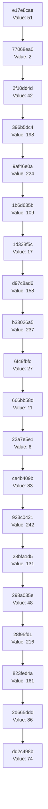

# Hash Chain Visualization

```mermaid
graph TD
    C0["dd2c498b<br/>Value: 74"]
    C1["2d665ddd<br/>Value: 86"]
    C1 --> C0
    C2["823fed4a<br/>Value: 161"]
    C2 --> C1
    C3["28f95fd1<br/>Value: 216"]
    C3 --> C2
    C4["298a035e<br/>Value: 48"]
    C4 --> C3
    C5["28bfa1d5<br/>Value: 131"]
    C5 --> C4
    C6["923c0421<br/>Value: 242"]
    C6 --> C5
    C7["ce4b409b<br/>Value: 83"]
    C7 --> C6
    C8["22a7e5e1<br/>Value: 6"]
    C8 --> C7
    C9["666bb58d<br/>Value: 11"]
    C9 --> C8
    C10["6f49fbfc<br/>Value: 27"]
    C10 --> C9
    C11["b33026a5<br/>Value: 237"]
    C11 --> C10
    C12["d97c8ad6<br/>Value: 158"]
    C12 --> C11
    C13["1d338f5c<br/>Value: 17"]
    C13 --> C12
    C14["1b6d635b<br/>Value: 109"]
    C14 --> C13
    C15["9af46e0a<br/>Value: 224"]
    C15 --> C14
    C16["396b5dc4<br/>Value: 198"]
    C16 --> C15
    C17["2f10dd4d<br/>Value: 42"]
    C17 --> C16
    C18["77068ea0<br/>Value: 2"]
    C18 --> C17
    C19["e17e8cae<br/>Value: 51"]
    C19 --> C18
```