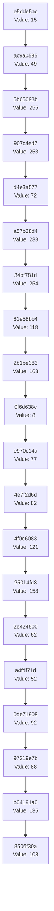

# Hash Chain Visualization

```mermaid
graph TD
    C0["8506f30a<br/>Value: 108"]
    C1["b04191a0<br/>Value: 135"]
    C1 --> C0
    C2["97219e7b<br/>Value: 88"]
    C2 --> C1
    C3["0de71908<br/>Value: 92"]
    C3 --> C2
    C4["a4fdf71d<br/>Value: 52"]
    C4 --> C3
    C5["2e424500<br/>Value: 62"]
    C5 --> C4
    C6["25014fd3<br/>Value: 158"]
    C6 --> C5
    C7["4f0e6083<br/>Value: 121"]
    C7 --> C6
    C8["4e7f2d6d<br/>Value: 82"]
    C8 --> C7
    C9["e970c14a<br/>Value: 77"]
    C9 --> C8
    C10["0f6d638c<br/>Value: 8"]
    C10 --> C9
    C11["2b1be383<br/>Value: 163"]
    C11 --> C10
    C12["81e58bb4<br/>Value: 118"]
    C12 --> C11
    C13["34bf781d<br/>Value: 254"]
    C13 --> C12
    C14["a57b38d4<br/>Value: 233"]
    C14 --> C13
    C15["d4e3a577<br/>Value: 72"]
    C15 --> C14
    C16["907c4ed7<br/>Value: 253"]
    C16 --> C15
    C17["5b65093b<br/>Value: 255"]
    C17 --> C16
    C18["ac9a0585<br/>Value: 49"]
    C18 --> C17
    C19["e5dde5ac<br/>Value: 15"]
    C19 --> C18
```