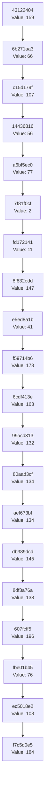

# Hash Chain Visualization

```mermaid
graph TD
    C0["f7c5d0e5<br/>Value: 184"]
    C1["ec5018e2<br/>Value: 108"]
    C1 --> C0
    C2["fbe01b45<br/>Value: 76"]
    C2 --> C1
    C3["607fcff5<br/>Value: 196"]
    C3 --> C2
    C4["8df3a76a<br/>Value: 138"]
    C4 --> C3
    C5["db389dcd<br/>Value: 145"]
    C5 --> C4
    C6["aef673bf<br/>Value: 134"]
    C6 --> C5
    C7["80aad3cf<br/>Value: 134"]
    C7 --> C6
    C8["99acd313<br/>Value: 132"]
    C8 --> C7
    C9["6cdf413e<br/>Value: 163"]
    C9 --> C8
    C10["f59714b6<br/>Value: 173"]
    C10 --> C9
    C11["e5ed8a1b<br/>Value: 41"]
    C11 --> C10
    C12["8f832edd<br/>Value: 147"]
    C12 --> C11
    C13["fd172141<br/>Value: 11"]
    C13 --> C12
    C14["7f81f0cf<br/>Value: 2"]
    C14 --> C13
    C15["a6bf5ec0<br/>Value: 77"]
    C15 --> C14
    C16["14436816<br/>Value: 56"]
    C16 --> C15
    C17["c15d179f<br/>Value: 107"]
    C17 --> C16
    C18["6b271aa3<br/>Value: 66"]
    C18 --> C17
    C19["43122404<br/>Value: 159"]
    C19 --> C18
```