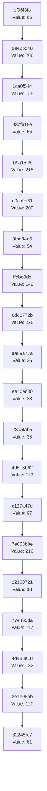

# Hash Chain Visualization

```mermaid
graph TD
    C0["82245fd7<br/>Value: 61"]
    C1["2e1e08ab<br/>Value: 120"]
    C1 --> C0
    C2["4d488e18<br/>Value: 132"]
    C2 --> C1
    C3["77e465da<br/>Value: 117"]
    C3 --> C2
    C4["22160721<br/>Value: 18"]
    C4 --> C3
    C5["7e058b8e<br/>Value: 216"]
    C5 --> C4
    C6["c127a47d<br/>Value: 97"]
    C6 --> C5
    C7["495e3b62<br/>Value: 119"]
    C7 --> C6
    C8["23bafab5<br/>Value: 35"]
    C8 --> C7
    C9["ee40ec30<br/>Value: 33"]
    C9 --> C8
    C10["aa89a77a<br/>Value: 36"]
    C10 --> C9
    C11["6dd0772b<br/>Value: 228"]
    C11 --> C10
    C12["ffdbe8db<br/>Value: 149"]
    C12 --> C11
    C13["3fbd34d6<br/>Value: 54"]
    C13 --> C12
    C14["e0ca9d61<br/>Value: 209"]
    C14 --> C13
    C15["09a15ff6<br/>Value: 218"]
    C15 --> C14
    C16["937fb19e<br/>Value: 65"]
    C16 --> C15
    C17["1ca0f544<br/>Value: 155"]
    C17 --> C16
    C18["9e425548<br/>Value: 206"]
    C18 --> C17
    C19["ef96f3fb<br/>Value: 65"]
    C19 --> C18
```