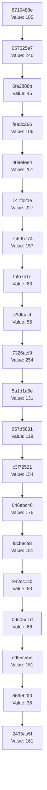

# Hash Chain Visualization

```mermaid
graph TD
    C0["2433aa5f<br/>Value: 161"]
    C1["869eb0f0<br/>Value: 36"]
    C1 --> C0
    C2["cd55c55e<br/>Value: 151"]
    C2 --> C1
    C3["09d05d1d<br/>Value: 66"]
    C3 --> C2
    C4["942cc1cb<br/>Value: 63"]
    C4 --> C3
    C5["fdcb9ca8<br/>Value: 181"]
    C5 --> C4
    C6["046ebc46<br/>Value: 176"]
    C6 --> C5
    C7["c3f72521<br/>Value: 154"]
    C7 --> C6
    C8["967d5831<br/>Value: 119"]
    C8 --> C7
    C9["5a1d1a6e<br/>Value: 131"]
    C9 --> C8
    C10["7326aef9<br/>Value: 254"]
    C10 --> C9
    C11["c9dfaacf<br/>Value: 56"]
    C11 --> C10
    C12["fbfb7b1e<br/>Value: 63"]
    C12 --> C11
    C13["7c69b774<br/>Value: 157"]
    C13 --> C12
    C14["141fb21e<br/>Value: 227"]
    C14 --> C13
    C15["009efee4<br/>Value: 251"]
    C15 --> C14
    C16["fea3c266<br/>Value: 106"]
    C16 --> C15
    C17["6fa2888b<br/>Value: 45"]
    C17 --> C16
    C18["057525e7<br/>Value: 246"]
    C18 --> C17
    C19["8719488e<br/>Value: 185"]
    C19 --> C18
```