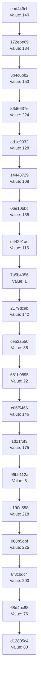

# Hash Chain Visualization

```mermaid
graph TD
    C0["d12805c4<br/>Value: 83"]
    C1["68d4bc88<br/>Value: 76"]
    C1 --> C0
    C2["8f3cbdc4<br/>Value: 200"]
    C2 --> C1
    C3["068b5dbf<br/>Value: 225"]
    C3 --> C2
    C4["c190d558<br/>Value: 218"]
    C4 --> C3
    C5["96bb112a<br/>Value: 5"]
    C5 --> C4
    C6["1d21f6f3<br/>Value: 175"]
    C6 --> C5
    C7["c06f5466<br/>Value: 146"]
    C7 --> C6
    C8["681b0895<br/>Value: 22"]
    C8 --> C7
    C9["ceb3a550<br/>Value: 38"]
    C9 --> C8
    C10["2179dc9b<br/>Value: 142"]
    C10 --> C9
    C11["7a5b4056<br/>Value: 1"]
    C11 --> C10
    C12["d44291ad<br/>Value: 115"]
    C12 --> C11
    C13["06e10bbc<br/>Value: 135"]
    C13 --> C12
    C14["14448729<br/>Value: 108"]
    C14 --> C13
    C15["ad1c9932<br/>Value: 128"]
    C15 --> C14
    C16["86d6637e<br/>Value: 224"]
    C16 --> C15
    C17["3b4c6bb2<br/>Value: 153"]
    C17 --> C16
    C18["172ebe69<br/>Value: 184"]
    C18 --> C17
    C19["ead449cb<br/>Value: 140"]
    C19 --> C18
```