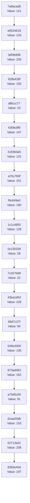

# Hash Chain Visualization

```mermaid
graph TD
    C0["8393e40d<br/>Value: 197"]
    C1["02713a31<br/>Value: 208"]
    C1 --> C0
    C2["d1aa20db<br/>Value: 153"]
    C2 --> C1
    C3["a70d5c00<br/>Value: 91"]
    C3 --> C2
    C4["873ad083<br/>Value: 162"]
    C4 --> C3
    C5["549e3309<br/>Value: 136"]
    C5 --> C4
    C6["68d7c27f<br/>Value: 94"]
    C6 --> C5
    C7["43ba1d63<br/>Value: 228"]
    C7 --> C6
    C8["7cd27b68<br/>Value: 22"]
    C8 --> C7
    C9["0c230328<br/>Value: 59"]
    C9 --> C8
    C10["1c1c4955<br/>Value: 128"]
    C10 --> C9
    C11["f9c649e0<br/>Value: 190"]
    C11 --> C10
    C12["a76c7b9f<br/>Value: 241"]
    C12 --> C11
    C13["318363a5<br/>Value: 131"]
    C13 --> C12
    C14["4308c8f9<br/>Value: 147"]
    C14 --> C13
    C15["d8fccc77<br/>Value: 10"]
    C15 --> C14
    C16["928b428f<br/>Value: 155"]
    C16 --> C15
    C17["3df3b808<br/>Value: 235"]
    C17 --> C16
    C18["e6534619<br/>Value: 133"]
    C18 --> C17
    C19["7a8acad8<br/>Value: 141"]
    C19 --> C18
```