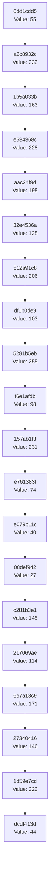

# Hash Chain Visualization

```mermaid
graph TD
    C0["dcdf413d<br/>Value: 44"]
    C1["1d59e7cd<br/>Value: 222"]
    C1 --> C0
    C2["27340416<br/>Value: 146"]
    C2 --> C1
    C3["6e7a18c9<br/>Value: 171"]
    C3 --> C2
    C4["217069ae<br/>Value: 114"]
    C4 --> C3
    C5["c281b3e1<br/>Value: 145"]
    C5 --> C4
    C6["08def942<br/>Value: 27"]
    C6 --> C5
    C7["e079b11c<br/>Value: 40"]
    C7 --> C6
    C8["e761383f<br/>Value: 74"]
    C8 --> C7
    C9["157ab1f3<br/>Value: 231"]
    C9 --> C8
    C10["f6e1afdb<br/>Value: 98"]
    C10 --> C9
    C11["5281b5eb<br/>Value: 255"]
    C11 --> C10
    C12["df1b0de9<br/>Value: 103"]
    C12 --> C11
    C13["512a91c8<br/>Value: 206"]
    C13 --> C12
    C14["32e4536a<br/>Value: 128"]
    C14 --> C13
    C15["aac24f9d<br/>Value: 198"]
    C15 --> C14
    C16["e534368c<br/>Value: 228"]
    C16 --> C15
    C17["1b5a033b<br/>Value: 163"]
    C17 --> C16
    C18["a2c8932c<br/>Value: 232"]
    C18 --> C17
    C19["6dd1cdd5<br/>Value: 55"]
    C19 --> C18
```