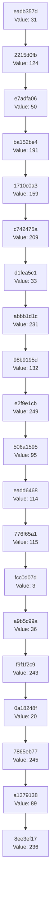

# Hash Chain Visualization

```mermaid
graph TD
    C0["8ee3ef17<br/>Value: 236"]
    C1["a1379138<br/>Value: 89"]
    C1 --> C0
    C2["7865eb77<br/>Value: 245"]
    C2 --> C1
    C3["0a18248f<br/>Value: 20"]
    C3 --> C2
    C4["f9f1f2c9<br/>Value: 243"]
    C4 --> C3
    C5["a9b5c99a<br/>Value: 36"]
    C5 --> C4
    C6["fcc0d07d<br/>Value: 3"]
    C6 --> C5
    C7["776f65a1<br/>Value: 115"]
    C7 --> C6
    C8["eadd6468<br/>Value: 114"]
    C8 --> C7
    C9["506a1595<br/>Value: 95"]
    C9 --> C8
    C10["e2f9e1cb<br/>Value: 249"]
    C10 --> C9
    C11["98b9195d<br/>Value: 132"]
    C11 --> C10
    C12["abbb1d1c<br/>Value: 231"]
    C12 --> C11
    C13["d1fea5c1<br/>Value: 33"]
    C13 --> C12
    C14["c742475a<br/>Value: 209"]
    C14 --> C13
    C15["1710c0a3<br/>Value: 159"]
    C15 --> C14
    C16["ba152be4<br/>Value: 191"]
    C16 --> C15
    C17["e7adfa06<br/>Value: 50"]
    C17 --> C16
    C18["2215d0fb<br/>Value: 124"]
    C18 --> C17
    C19["eadb357d<br/>Value: 31"]
    C19 --> C18
```