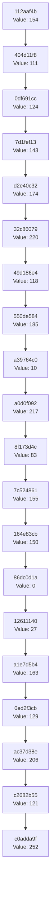

# Hash Chain Visualization

```mermaid
graph TD
    C0["c0adda9f<br/>Value: 252"]
    C1["c2682b55<br/>Value: 121"]
    C1 --> C0
    C2["ac37d38e<br/>Value: 206"]
    C2 --> C1
    C3["0ed2f3cb<br/>Value: 129"]
    C3 --> C2
    C4["a1e7d5b4<br/>Value: 163"]
    C4 --> C3
    C5["12611140<br/>Value: 27"]
    C5 --> C4
    C6["86dc0d1a<br/>Value: 0"]
    C6 --> C5
    C7["164e83cb<br/>Value: 150"]
    C7 --> C6
    C8["7c524861<br/>Value: 155"]
    C8 --> C7
    C9["8f173d4c<br/>Value: 83"]
    C9 --> C8
    C10["a0d0f092<br/>Value: 217"]
    C10 --> C9
    C11["a39764c0<br/>Value: 10"]
    C11 --> C10
    C12["550de584<br/>Value: 185"]
    C12 --> C11
    C13["49d186e4<br/>Value: 118"]
    C13 --> C12
    C14["32c86079<br/>Value: 220"]
    C14 --> C13
    C15["d2e40c32<br/>Value: 174"]
    C15 --> C14
    C16["7d1fef13<br/>Value: 143"]
    C16 --> C15
    C17["0df691cc<br/>Value: 124"]
    C17 --> C16
    C18["404d11f8<br/>Value: 111"]
    C18 --> C17
    C19["112aaf4b<br/>Value: 154"]
    C19 --> C18
```