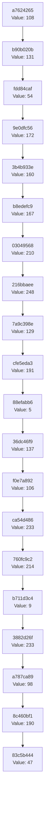

# Hash Chain Visualization

```mermaid
graph TD
    C0["83c5b444<br/>Value: 47"]
    C1["8c460bf1<br/>Value: 190"]
    C1 --> C0
    C2["a787ca89<br/>Value: 98"]
    C2 --> C1
    C3["3882d26f<br/>Value: 233"]
    C3 --> C2
    C4["b711d3c4<br/>Value: 9"]
    C4 --> C3
    C5["760fc9c2<br/>Value: 214"]
    C5 --> C4
    C6["ca54d486<br/>Value: 233"]
    C6 --> C5
    C7["f0e7a892<br/>Value: 106"]
    C7 --> C6
    C8["36dc46f9<br/>Value: 137"]
    C8 --> C7
    C9["88efabb6<br/>Value: 5"]
    C9 --> C8
    C10["cfe5eda3<br/>Value: 191"]
    C10 --> C9
    C11["7a9c398e<br/>Value: 129"]
    C11 --> C10
    C12["216bbaee<br/>Value: 248"]
    C12 --> C11
    C13["03049568<br/>Value: 210"]
    C13 --> C12
    C14["b8edefc9<br/>Value: 167"]
    C14 --> C13
    C15["3b4b933e<br/>Value: 160"]
    C15 --> C14
    C16["9e0dfc56<br/>Value: 172"]
    C16 --> C15
    C17["fdd84caf<br/>Value: 54"]
    C17 --> C16
    C18["b90b020b<br/>Value: 131"]
    C18 --> C17
    C19["a7624265<br/>Value: 108"]
    C19 --> C18
```