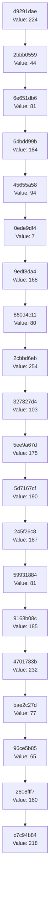

# Hash Chain Visualization

```mermaid
graph TD
    C0["c7c94b84<br/>Value: 218"]
    C1["2808fff7<br/>Value: 180"]
    C1 --> C0
    C2["96ce5b85<br/>Value: 65"]
    C2 --> C1
    C3["bae2c27d<br/>Value: 77"]
    C3 --> C2
    C4["4701783b<br/>Value: 232"]
    C4 --> C3
    C5["9168b08c<br/>Value: 185"]
    C5 --> C4
    C6["59931884<br/>Value: 81"]
    C6 --> C5
    C7["245f26c8<br/>Value: 187"]
    C7 --> C6
    C8["5d7167cf<br/>Value: 190"]
    C8 --> C7
    C9["5ee9a67d<br/>Value: 175"]
    C9 --> C8
    C10["327827d4<br/>Value: 103"]
    C10 --> C9
    C11["2cbbd6eb<br/>Value: 254"]
    C11 --> C10
    C12["860d4c11<br/>Value: 80"]
    C12 --> C11
    C13["9edf8da4<br/>Value: 168"]
    C13 --> C12
    C14["0ede9df4<br/>Value: 7"]
    C14 --> C13
    C15["45655a58<br/>Value: 94"]
    C15 --> C14
    C16["64bdd99b<br/>Value: 184"]
    C16 --> C15
    C17["6e651db6<br/>Value: 81"]
    C17 --> C16
    C18["2bbb0559<br/>Value: 44"]
    C18 --> C17
    C19["d9291dae<br/>Value: 224"]
    C19 --> C18
```