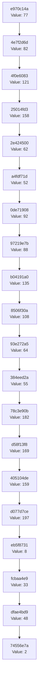

# Hash Chain Visualization

```mermaid
graph TD
    C0["74556e7a<br/>Value: 2"]
    C1["dfae4bd9<br/>Value: 48"]
    C1 --> C0
    C2["fcbaa4e9<br/>Value: 33"]
    C2 --> C1
    C3["eb5f8731<br/>Value: 8"]
    C3 --> C2
    C4["d077d7ce<br/>Value: 197"]
    C4 --> C3
    C5["405104de<br/>Value: 159"]
    C5 --> C4
    C6["d58f13f8<br/>Value: 169"]
    C6 --> C5
    C7["78c3e90b<br/>Value: 182"]
    C7 --> C6
    C8["384eed2a<br/>Value: 55"]
    C8 --> C7
    C9["93e272a5<br/>Value: 64"]
    C9 --> C8
    C10["8506f30a<br/>Value: 108"]
    C10 --> C9
    C11["b04191a0<br/>Value: 135"]
    C11 --> C10
    C12["97219e7b<br/>Value: 88"]
    C12 --> C11
    C13["0de71908<br/>Value: 92"]
    C13 --> C12
    C14["a4fdf71d<br/>Value: 52"]
    C14 --> C13
    C15["2e424500<br/>Value: 62"]
    C15 --> C14
    C16["25014fd3<br/>Value: 158"]
    C16 --> C15
    C17["4f0e6083<br/>Value: 121"]
    C17 --> C16
    C18["4e7f2d6d<br/>Value: 82"]
    C18 --> C17
    C19["e970c14a<br/>Value: 77"]
    C19 --> C18
```