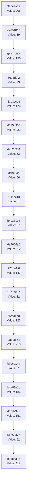

# Hash Chain Visualization

```mermaid
graph TD
    C0["b01eda17<br/>Value: 117"]
    C1["64d5942d<br/>Value: 52"]
    C1 --> C0
    C2["41cd7997<br/>Value: 152"]
    C2 --> C1
    C3["b4a81e1c<br/>Value: 186"]
    C3 --> C2
    C4["bbc6d14a<br/>Value: 7"]
    C4 --> C3
    C5["0aef3b64<br/>Value: 218"]
    C5 --> C4
    C6["f12ea4ed<br/>Value: 123"]
    C6 --> C5
    C7["13b7e89a<br/>Value: 32"]
    C7 --> C6
    C8["775da1f6<br/>Value: 147"]
    C8 --> C7
    C9["6a4666a5<br/>Value: 212"]
    C9 --> C8
    C10["b49331e8<br/>Value: 37"]
    C10 --> C9
    C11["b1fb761c<br/>Value: 1"]
    C11 --> C10
    C12["3f4fe5cc<br/>Value: 66"]
    C12 --> C11
    C13["4e82b384<br/>Value: 63"]
    C13 --> C12
    C14["6085d306<br/>Value: 233"]
    C14 --> C13
    C15["83c3cca3<br/>Value: 176"]
    C15 --> C14
    C16["6623d9f2<br/>Value: 93"]
    C16 --> C15
    C17["9db7824b<br/>Value: 156"]
    C17 --> C16
    C18["c7a548d7<br/>Value: 39"]
    C18 --> C17
    C19["973e4a72<br/>Value: 205"]
    C19 --> C18
```