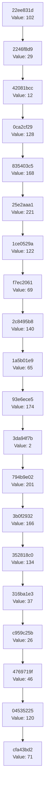

# Hash Chain Visualization

```mermaid
graph TD
    C0["cfa43bd2<br/>Value: 71"]
    C1["04535225<br/>Value: 120"]
    C1 --> C0
    C2["4769719f<br/>Value: 46"]
    C2 --> C1
    C3["c959c25b<br/>Value: 26"]
    C3 --> C2
    C4["316ba1e3<br/>Value: 37"]
    C4 --> C3
    C5["352818c0<br/>Value: 134"]
    C5 --> C4
    C6["3b0f2932<br/>Value: 166"]
    C6 --> C5
    C7["794b9e02<br/>Value: 201"]
    C7 --> C6
    C8["3da94f7b<br/>Value: 2"]
    C8 --> C7
    C9["93e6ece5<br/>Value: 174"]
    C9 --> C8
    C10["1a5b01e9<br/>Value: 65"]
    C10 --> C9
    C11["2c8495b8<br/>Value: 140"]
    C11 --> C10
    C12["f7ec2061<br/>Value: 69"]
    C12 --> C11
    C13["1ce0529a<br/>Value: 122"]
    C13 --> C12
    C14["25e2aaa1<br/>Value: 221"]
    C14 --> C13
    C15["835403c5<br/>Value: 168"]
    C15 --> C14
    C16["0ca2cf29<br/>Value: 128"]
    C16 --> C15
    C17["42081bcc<br/>Value: 12"]
    C17 --> C16
    C18["2246f8d9<br/>Value: 29"]
    C18 --> C17
    C19["22ee831d<br/>Value: 102"]
    C19 --> C18
```