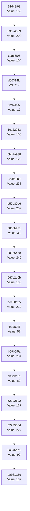

# Hash Chain Visualization

```mermaid
graph TD
    C0["eab81a5c<br/>Value: 187"]
    C1["9a346da1<br/>Value: 90"]
    C1 --> C0
    C2["5793558d<br/>Value: 227"]
    C2 --> C1
    C3["522d2602<br/>Value: 137"]
    C3 --> C2
    C4["b38d3c91<br/>Value: 69"]
    C4 --> C3
    C5["b09b5f5a<br/>Value: 234"]
    C5 --> C4
    C6["ffa0a685<br/>Value: 57"]
    C6 --> C5
    C7["bdc00c25<br/>Value: 222"]
    C7 --> C6
    C8["067c2d0b<br/>Value: 136"]
    C8 --> C7
    C9["0a3e64de<br/>Value: 240"]
    C9 --> C8
    C10["0808b231<br/>Value: 38"]
    C10 --> C9
    C11["b50e80e6<br/>Value: 209"]
    C11 --> C10
    C12["3b4fd2b9<br/>Value: 238"]
    C12 --> C11
    C13["5bb7a938<br/>Value: 125"]
    C13 --> C12
    C14["1ca22953<br/>Value: 105"]
    C14 --> C13
    C15["0b9445f7<br/>Value: 17"]
    C15 --> C14
    C16["d56314fc<br/>Value: 7"]
    C16 --> C15
    C17["6ca66f06<br/>Value: 104"]
    C17 --> C16
    C18["63b74669<br/>Value: 209"]
    C18 --> C17
    C19["51648f98<br/>Value: 155"]
    C19 --> C18
```