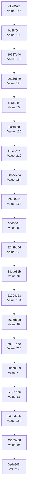

# Hash Chain Visualization

```mermaid
graph TD
    C0["0ede9df4<br/>Value: 7"]
    C1["45655a58<br/>Value: 94"]
    C1 --> C0
    C2["64bdd99b<br/>Value: 184"]
    C2 --> C1
    C3["6e651db6<br/>Value: 81"]
    C3 --> C2
    C4["2bbb0559<br/>Value: 44"]
    C4 --> C3
    C5["d9291dae<br/>Value: 224"]
    C5 --> C4
    C6["4615d60e<br/>Value: 87"]
    C6 --> C5
    C7["21994d23<br/>Value: 134"]
    C7 --> C6
    C8["33cde81b<br/>Value: 31"]
    C8 --> C7
    C9["3242bd5d<br/>Value: 176"]
    C9 --> C8
    C10["64d5064f<br/>Value: 82"]
    C10 --> C9
    C11["a9e504a1<br/>Value: 168"]
    C11 --> C10
    C12["28bbc7d4<br/>Value: 184"]
    C12 --> C11
    C13["f83c0e1d<br/>Value: 219"]
    C13 --> C12
    C14["8ccf80f8<br/>Value: 116"]
    C14 --> C13
    C15["b95b24fa<br/>Value: 77"]
    C15 --> C14
    C16["e0a6e549<br/>Value: 120"]
    C16 --> C15
    C17["19627e40<br/>Value: 115"]
    C17 --> C16
    C18["bb88f0c4<br/>Value: 102"]
    C18 --> C17
    C19["dffa8025<br/>Value: 146"]
    C19 --> C18
```