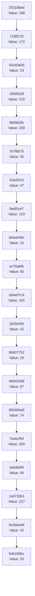

# Hash Chain Visualization

```mermaid
graph TD
    C0["b4b169bc<br/>Value: 26"]
    C1["0e3daedb<br/>Value: 42"]
    C1 --> C0
    C2["1a471bb1<br/>Value: 227"]
    C2 --> C1
    C3["3a6d6df4<br/>Value: 40"]
    C3 --> C2
    C4["7aebcf56<br/>Value: 200"]
    C4 --> C3
    C5["992484a5<br/>Value: 74"]
    C5 --> C4
    C6["46845468<br/>Value: 87"]
    C6 --> C5
    C7["9b607752<br/>Value: 29"]
    C7 --> C6
    C8["3d1fe50b<br/>Value: 42"]
    C8 --> C7
    C9["a5ee07c4<br/>Value: 181"]
    C9 --> C8
    C10["ec76abfb<br/>Value: 65"]
    C10 --> C9
    C11["b0aa049c<br/>Value: 10"]
    C11 --> C10
    C12["fae85ce7<br/>Value: 153"]
    C12 --> C11
    C13["03a2f2c5<br/>Value: 47"]
    C13 --> C12
    C14["7e7fbb75<br/>Value: 35"]
    C14 --> C13
    C15["9b08d2fe<br/>Value: 159"]
    C15 --> C14
    C16["19b85d2f<br/>Value: 215"]
    C16 --> C15
    C17["43cb0a0d<br/>Value: 23"]
    C17 --> C16
    C18["718f672f<br/>Value: 172"]
    C18 --> C17
    C19["25318bed<br/>Value: 188"]
    C19 --> C18
```