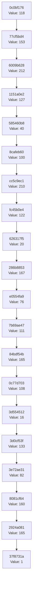

# Hash Chain Visualization

```mermaid
graph TD
    C0["37f8731a<br/>Value: 1"]
    C1["2924a081<br/>Value: 165"]
    C1 --> C0
    C2["8081cf64<br/>Value: 160"]
    C2 --> C1
    C3["3e72ae31<br/>Value: 82"]
    C3 --> C2
    C4["3d0cf53f<br/>Value: 133"]
    C4 --> C3
    C5["3d554512<br/>Value: 16"]
    C5 --> C4
    C6["0c77d703<br/>Value: 108"]
    C6 --> C5
    C7["84bdf54b<br/>Value: 165"]
    C7 --> C6
    C8["7b69ae47<br/>Value: 111"]
    C8 --> C7
    C9["e0554fa9<br/>Value: 76"]
    C9 --> C8
    C10["286b8853<br/>Value: 167"]
    C10 --> C9
    C11["626317f5<br/>Value: 20"]
    C11 --> C10
    C12["fc45b0e4<br/>Value: 122"]
    C12 --> C11
    C13["cc5c9ec1<br/>Value: 210"]
    C13 --> C12
    C14["8cafeb60<br/>Value: 100"]
    C14 --> C13
    C15["585460b8<br/>Value: 40"]
    C15 --> C14
    C16["1151a0e2<br/>Value: 127"]
    C16 --> C15
    C17["6009b628<br/>Value: 212"]
    C17 --> C16
    C18["77cf5bd4<br/>Value: 153"]
    C18 --> C17
    C19["0c0bf176<br/>Value: 118"]
    C19 --> C18
```