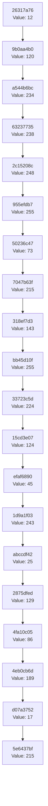

# Hash Chain Visualization

```mermaid
graph TD
    C0["5e6437bf<br/>Value: 215"]
    C1["d07a3752<br/>Value: 17"]
    C1 --> C0
    C2["4eb0cb6d<br/>Value: 189"]
    C2 --> C1
    C3["4fa10c05<br/>Value: 86"]
    C3 --> C2
    C4["2875dfed<br/>Value: 129"]
    C4 --> C3
    C5["abccdf42<br/>Value: 25"]
    C5 --> C4
    C6["1d9a1f03<br/>Value: 243"]
    C6 --> C5
    C7["efaf6890<br/>Value: 45"]
    C7 --> C6
    C8["15cd3e07<br/>Value: 124"]
    C8 --> C7
    C9["33723c5d<br/>Value: 224"]
    C9 --> C8
    C10["bb45d10f<br/>Value: 255"]
    C10 --> C9
    C11["318ef7d3<br/>Value: 143"]
    C11 --> C10
    C12["7047b63f<br/>Value: 215"]
    C12 --> C11
    C13["50236c47<br/>Value: 73"]
    C13 --> C12
    C14["955efdb7<br/>Value: 255"]
    C14 --> C13
    C15["2c15208c<br/>Value: 248"]
    C15 --> C14
    C16["63237735<br/>Value: 238"]
    C16 --> C15
    C17["a544b6bc<br/>Value: 234"]
    C17 --> C16
    C18["9b0aa4b0<br/>Value: 120"]
    C18 --> C17
    C19["26317a76<br/>Value: 12"]
    C19 --> C18
```