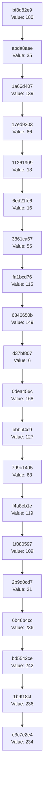

# Hash Chain Visualization

```mermaid
graph TD
    C0["e3c7e2e4<br/>Value: 234"]
    C1["1b9f18cf<br/>Value: 236"]
    C1 --> C0
    C2["bd5542ce<br/>Value: 242"]
    C2 --> C1
    C3["6b46b4cc<br/>Value: 236"]
    C3 --> C2
    C4["2b9d0cd7<br/>Value: 21"]
    C4 --> C3
    C5["1f080597<br/>Value: 109"]
    C5 --> C4
    C6["f4a8eb1e<br/>Value: 119"]
    C6 --> C5
    C7["799b14d5<br/>Value: 63"]
    C7 --> C6
    C8["bbbbf4c9<br/>Value: 127"]
    C8 --> C7
    C9["0dea456c<br/>Value: 168"]
    C9 --> C8
    C10["d37bf807<br/>Value: 6"]
    C10 --> C9
    C11["6346650b<br/>Value: 149"]
    C11 --> C10
    C12["fa1bcd76<br/>Value: 115"]
    C12 --> C11
    C13["3861ca67<br/>Value: 55"]
    C13 --> C12
    C14["6ed21fe6<br/>Value: 16"]
    C14 --> C13
    C15["11261909<br/>Value: 13"]
    C15 --> C14
    C16["17ed9303<br/>Value: 86"]
    C16 --> C15
    C17["1a66d407<br/>Value: 139"]
    C17 --> C16
    C18["abda8aee<br/>Value: 35"]
    C18 --> C17
    C19["bf8d82e9<br/>Value: 180"]
    C19 --> C18
```